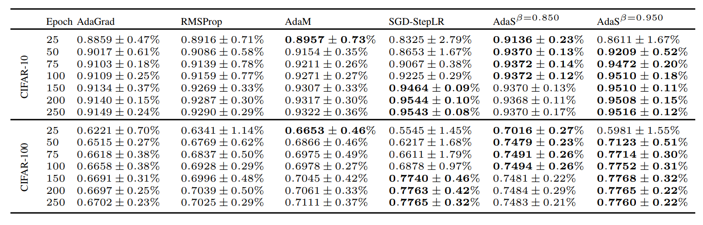
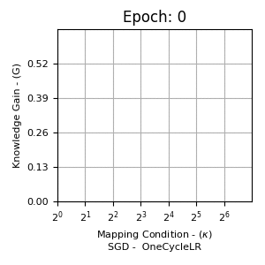
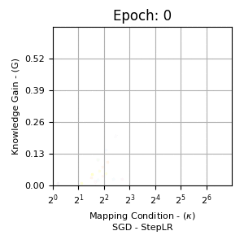
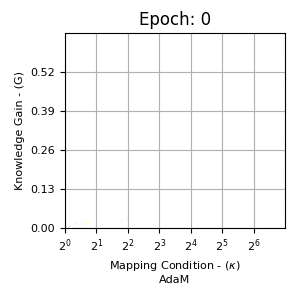
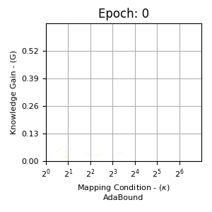
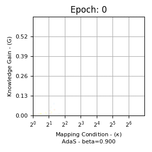

# Adas: Adaptive Scheduling of Stochastic Gradients #
[Paper](https://arxiv.org/abs/2006.06587)
## Status ##
[](LICENSE)
[](https://GitHub.com/Naereen/StrapDown.js/graphs/commit-activity)
[](https://www.python.org/downloads/release/python-370/)

## Table of Contents ##
- [Introduction](#introduction)
- [License](#license)
- [Citing AdaS](#citing-adas)
- [Empirical Classification Results on CIFAR10 and CIFAR100](#empirical-classification-results-on-cifar10-and-cifar100)
- [Knowledge Gain Vs. Mapping Condition - CNN Quality Metrics](#knowledge-gain-vs-mapping-condition---cnn-quality-metrics)
- [Requirements](#requirements)
  * [Software](#software)
  * [Hardware](#hardware)
  * [Some Experimental Results](#some-experimental-results)
- [Installation](#installation)
  * [Python Package](#python-package)
    + [Direct pip-installation](#direct-pip-installation)
    + [Repository Cloning](#repository-cloning)
  * [Unpackaged Python](#unpackaged-python)
- [Usage](#usage)
  * [Training](#training)
  * [Config Options](#config-options)
    + [Available Datasets for Training](#available-datasets-for-training)
    + [Available Models for Training](#available-models-for-training)
    + [Optimizer Method](#optimizer-method)
    + [Learning Rate Scheduler](#learning-rate-scheduler)
    + [Number of Training Trials](#number-of-training-trials)
    + [Beta](#beta)
    + [Initial Learning Rate](#initial-learning-rate)
    + [Max Epochs](#max-epochs)
    + [Early Stopping Threshold](#early-stopping-threshold)
    + [Early Stopping Patience](#early-stopping-patience)
    + [Mini-Batch Size](#mini-batch-size)
    + [Minimum Learning Rate](#minimum-learning-rate)
    + [Zeta](#zeta)
    + [Power](#power)
  * [Training Outputs](#training-outputs)
    + [XLSX Output](#xlsx-output)
    + [Checkpoints](#checkpoints)
  * [Plotting Graphs](#plotting-graphs)
- [Common Issues (running list)](#common-issues--running-list-)
- [Pytest](#pytest)

## Introduction ##
[Paper](https://arxiv.org/abs/2006.06587)

**AdaS** is an optimizer with adaptive scheduled learning rate methodology for training Convolutional Neural Networks (CNN).

- AdaS exhibits the rapid minimization characteristics that adaptive optimizers like [AdaM](https://arxiv.org/abs/1412.6980) are favoured for
- AdaS exhibits *generalization* (low testing loss) characteristics on par with SGD based optimizers, improving on the poor *generalization* characteristics of adaptive optimizers
- AdaS introduces no computational overhead over adaptive optimizers (see [experimental results](#some-experimental-results))
- In addition to optimization, AdaS introduces new quality metrics for CNN training ([quality metrics](#knowledge-gain-vs-mapping-condition---cnn-quality-metrics))

This repository contains a [PyTorch](https://pytorch.org/) implementation of the AdaS learning rate scheduler algorithm.

### License ###
AdaS is released under the MIT License (refer to the [LICENSE](LICENSE) file for more information)
|Permissions|Conditions|Limitations|
|---|---|---|
| Commerical use| License and Copyright Notice| Liability|
| Distribution| |  Warranty|
| Modification | | |
| Private Use| | |

### Citing AdaS ###
```text
@misc{hosseini2020adas,
    title={AdaS: Adaptive Scheduling of Stochastic Gradients},
    author={Mahdi S. Hosseini and Konstantinos N. Plataniotis},
    year={2020},
    eprint={2006.06587},
    archivePrefix={arXiv},
    primaryClass={cs.LG}
}
```
### Empirical Classification Results on CIFAR10 and CIFAR100 ###
[CIFAR10](https://www.cs.toronto.edu/~kriz/cifar.html)/[CIFAR100](https://www.cs.toronto.edu/~kriz/cifar.html)

**Figure 1: Training performance using different optimizers across two datasets (CIFAR10 and CIFA100) and two CNNs (VGG16 and ResNet34)**


**Table 1: Image classification performance (test accuracy) with fixed budget epoch of ResNet34 on CIFAR10 and CIFAR100 using various optimizers**


### Knowledge Gain Vs. Mapping Condition - CNN Quality Metrics ###
**Evolution of knowledge gain vs. mapping condition across different training epochs using ResNet34 on CIFAR10. Different colours represnets different conv blocks, and transparency is correlated to training epoch--lower transparency means higher epoch**









### Requirements ###
#### Software ####
We use `Python 3.7`

Per [requirements.txt](requirements.txt), the following Python packages are required:
```text
attrs==19.3.0
coverage==5.1
et-xmlfile==1.0.1
future==0.18.2
importlib-metadata==1.6.1
jdcal==1.4.1
more-itertools==8.3.0
numpy==1.18.5
openpyxl==3.0.3
packaging==20.4
pandas==1.0.4
Pillow==7.1.2
pluggy==0.13.1
py==1.8.1
pyparsing==2.4.7
pytest==5.4.3
pytest-cov==2.9.0
pytest-cover==3.0.0
pytest-coverage==0.0
python-dateutil==2.8.1
pytz==2020.1
PyYAML==5.3.1
scipy==1.4.1
six==1.15.0
torch==1.5.0
torchvision==0.6.0
wcwidth==0.2.4
zipp==3.1.0
```

**NOTE** that in order to satisfy `torch==1.5.0` the following Nvidia requirements need to be met:
- CUDA Version: `CUDA 10.2`
- CUDA Driver Version: `r440`
- CUDNN Version: `7.6.4-7.6.5`
For more information, refer to the [cudnn-support-matrix](https://docs.nvidia.com/deeplearning/sdk/cudnn-support-matrix/index.html).

Refer to the [PyTorch installation guide](https://pytorch.org/) for information how to install PyTorch. We do not guarantee proper function of this code using different versions of PyTorch or CUDA.

#### Hardware ####
- GPU
  - At least 4 GB of GPU memory is required
- Memory
  - At least 8 GB of internal memory is required
Naturally, the memory requirements is scaled relative to current dataset being used and mini-batch sizes, we state these number using the CIFAR10 and CIFAR100 dataset.

#### Some Experimental Results ####
Further, we state the following results for certain training configurations to give you an idea of what to expect:

**hardware specs**:
- GPU: RTX2080
- 32GB DDR4 Ram

**config.yaml**:
```yaml
###### Application Specific ######
dataset: 'CIFAR10' # options: CIFAR100, CIFAR10, ImageNet
network: 'VGG16' # options: VGG166, DPN92, SENet18, densenet_cifar, GoogLeNet, ShuffleNetG2, ShuffleNetV2, ResNet34, ResNeXt29_2x64d, PreActResNet18, MobileNet, MobileNetV2, EfficientNetB0
optim_method: 'SGD' # options: SGD, AdaM, AdaGrad, RMSProp, AdaDelta
lr_scheduler: 'AdaS' # options: AdaS (with SGD), StepLR, CosineAnnealingWarmRestarts, OneCycleLR


###### Suggested Tune ######
n_trials: 5
beta: 0.8
init_lr: 0.03  # Application specific


###### Suggested Default ######
max_epoch: 150
early_stop_threshold: 0.001 # set to -1 if you wish not to use early stop, or equally, set to a high value. Set to -1 if not using AdaS
early_stop_patience: 10 # epoch window to consider when deciding whether to stop
mini_batch_size: 128
min_lr: 0.00000000000000000001
zeta: 1.0
p: 1 # options: 1, 2.
loss: 'cross_entropy' # options: cross_entropy
```
|Optimizer|Learning Rate Scheduler|Epoch Time (avg.)|RAM (Memory) Consumed|GPU Memory Consumed|
|---|---|---|---|---|
|SGD|None|40-43 seconds |~6.2 GB|~3.75 GB|
|SGD|AdaS|40-43 seconds |~6.2 GB|~3.75 GB|
|ADAM|None|40-43 seconds|~6.2 GB|~3.75 GB|


We identify that each experiment is identical is computational performance.

### Installation ###
There are two version of the AdaS code contained in this repository.
1. a python-package version of the AdaS code, which can be `pip`-installed.
2. a static python module, provided in addition to the package for any user who may want an unpackaged version of the code. This code can be found at [unpackaged](unpackaged)

#### Python Package ####

---

##### Repository Cloning #####
After cloning the repository, simply run
```console
python setup.py build
python setup.py install
```

#### Unpackaged Python ####

---
Ensure first that you have the requirements installed per [requirements.txt](requirements.txt)

You can run the code either by typing
```console
python main.py train --...
```
OR
```console
python train.py --...
```
Where `--...` represents the options for training (see below)

### Usage ###
#### Training ####
As this is a self-contained python module, all functionalities are built in once you `pip`-install the package. To start training, you must first define you configuration file. An example can be found at [src/adas/config.yaml](src/adas/config.yaml). Finally, run
```console
python -m adas train --config *config.yaml*
```
Where you specify the path of you `config.yaml` file. Note the following options for adas:
```console

python -m adas train --help
--
usage: __main__.py train [-h] [--config CONFIG] [--data DATA]
                         [--output OUTPUT] [--checkpoint CHECKPOINT]
                         [--root ROOT] [-r]

optional arguments:
  -h, --help            show this help message and exit
  --config CONFIG       Set configuration file path: Default = 'config.yaml'
  --data DATA           Set data directory path: Default = '.adas-data'
  --output OUTPUT       Set output directory path: Default = '.adas-output'
  --checkpoint CHECKPOINT
                        Set checkpoint directory path: Default = '.adas-checkpoint
  --root ROOT           Set root path of project that parents all others:
                        Default = '.'
  -r, --resume          Flag: resume training from checkpoint
```
#### Config Options ####
In the following sections we list the configuration options available to the user. Note that we also classify the configuration options into the following categories:
- Suggested Default
  - max_epoch
  - early_stop_threshold
  - early_stop_patience
  - min_lr
  - zeta
  - p
  - loss
- Suggested Tune
  - n_trials
  - beta
  - init_lr
- Application Specific
  - dataset
  - network
  - optim_method
  - lr_scheduler

The **Suggested Default** parameters are ones we have preset and suggest not be altered too much. Naturally, the user may change them at their discretion, however these values were found to be stable and optimal.

The **Suggested Tune** parameters are highly recommended to be tuned, and are very application specific.

The **Application Specific** parameters then are simply ones that the user must change to do what they want (what dataset, model, learning algorithm, etc.)


##### Available Datasets for Training #####
---
**yaml identifier: dataset**
Currently only the following datasets are supported:
- CIFAR10
- CIFAR100
- ImageNet (see [Common Issues](#common-issues--running-list-))

##### Available Models for Training #####

---
**yaml identifier: network**
All models used can be found in [src/adas/models](src/adas/models) in this repository are copied from [pytorch-cifar](https://github.com/kuangliu/pytorch-cifar). We note that modifications were made to these models to allow variable `num_classes` to be used, relative to the dataset being used for training. The available models are as follows:
- VGG16
- ResNet34
- PreActResNet18
- GoogLeNet
- densenet_cifar
- ResNeXt29_2x64d
- MobileNet
- MobileNetV2
- DPN92
- ShuffleNetG2
- SENet18
- ShuffleNetV2
- EfficientNetB0

##### Optimizer Method #####

---
**yaml identifier: optim_method**

Options:
- SGD
- AdaM
- AdaGrad
- RMSProp
- AdaDelta

##### Learning Rate Scheduler #####

---
**yaml identifier: lr_scheduler**

Options:
- AdaS (Note that `SGD` must be specified as the `optim_method`)
- StepLR
- CosineAnnealingWarmRestarts
- OneCycleLR

##### Number of Training Trials #####

---
**yaml identifier: n_trials**

Number of full training cycles

##### Beta #####

---
**yaml identifier: beta**

AdaS gain factor. Tunes the AdaS behaviour. Smaller means faster convergence, but lower final testing loss, and vice-versa.

##### Initial Learning Rate #####

---
**yaml identifier: init_lr**

Initial learning rate for the optimizer method

##### Max Epochs #####

---
**yaml identifier: max_epoch**

Maximum number of epochs for one trial

##### Early Stopping Threshold #####

---
**yaml identifier: early_stop_threshold**

***Note that early stopping should only be used for the SGD with AdaS algorithm. As per the paper, AdaS provides the ability to monitor simply training loss and be confident that a low training loss leads to a high test accuracy/low testing loss. Hence, we only use early stop for SGD with AdaS, monitoring the training loss, and do not recommend its use otherwise. ***

The threshold for early stopping. The early stopping criterion operates by keeping track of the best loss seen to date, and evaluates the current loss against the best loss by doing `current_loss - best_loss`. If this value is **greater than** the early stopping threshold, a counter begins. If this evaluation is true for `early_stop_patience` (see below) amount of epochs, then early stopping is activated.

To deactivate early_stopping, set this value to `-1`.

##### Early Stopping Patience #####

---
**yaml identifier: early_stop_patience**

Patience window for early stopping.

##### Mini-Batch Size #####

---
**yaml identifier: mini_batch_size**

Size of mini-batch for one epoch

##### Minimum Learning Rate #####

---
**yaml identifier: mini_batch_size**

Size of mini-batch for one epoch

##### Zeta #####

---
**yaml identifier: zeta**

The knowledge-gain hyper-parameter, another AdaS hyper-parameter. Typically always set to 1.

##### Power #####

---
**yaml identifier: p**

Power value for computing knowledge-gain. Can either be `1` or `2`.


#### Training Outputs ####
##### XLSX Output #####
Note that training progress is conveyed through console outputs, where per-epoch statements are outputed to indicate epoch time and train/test loss/accuracy.

Note also that a per-epoch updating `.xlsx` file is created for every training session. This file reports performance metrics of the CNN during training. An example is show in Table 2.
Table 2: Performance metrics of VGG16 trained on CIFAR100 - 1 Epoch
| Conv Block  | Train_loss_epoch_0 | in_S_epoch_0      | out_S_epoch_0     | fc_S_epoch_0      | in_rank_epoch_0 | out_rank_epoch_0 | fc_rank_epoch_0 | in_condition_epoch_0 | out_condition_epoch_0 | rank_velocity_0 | learning_rate_0 | acc_epoch_0 |
|----|--------------------|-------------------|-------------------|-------------------|-----------------|------------------|-----------------|----------------------|-----------------------|-----------------|-----------------|-------------|
| 0  | 4.52598691779329   | 0                 | 0                 | 0.007025059778243 | 0               | 0                | 0.01953125      | 0                    | 0                     | 0.03            | 0.03            | 0.0353      |
| 1  | 4.52598691779329   | 0.06363195180893  | 0.067244701087475 | 0.007025059778243 | 0.125           | 0.15625          | 0.01953125      | 4.14393854141235     | 5.25829029083252      | 0.03            | 0.03            | 0.0353      |
| 2  | 4.52598691779329   | 0.062127389013767 | 0.030436672270298 | 0.007025059778243 | 0.109375        | 0.046875         | 0.01953125      | 3.57764577865601     | 2.39811992645264      | 0.03            | 0.03            | 0.0353      |
| 3  | 4.52598691779329   | 0.035973243415356 | 0.030653497204185 | 0.007025059778243 | 0.0703125       | 0.0546875        | 0.01953125      | 3.60598373413086     | 3.2860517501831       | 0.03            | 0.03            | 0.0353      |
| 4  | 4.52598691779329   | 0.021210107952356 | 0.014563170261681 | 0.007025059778243 | 0.0390625       | 0.01953125       | 0.01953125      | 3.49767923355102     | 1.73739552497864      | 0.03            | 0.03            | 0.0353      |
| 5  | 4.52598691779329   | 0.017496244981885 | 0.018149495124817 | 0.007025059778243 | 0.03125         | 0.03125          | 0.01953125      | 3.05637526512146     | 2.64313006401062      | 0.03            | 0.03            | 0.0353      |
| 6  | 4.52598691779329   | 0.011354953050613 | 0.010315389372408 | 0.007025059778243 | 0.01953125      | 0.015625         | 0.01953125      | 2.54586839675903     | 2.25333142280579      | 0.03            | 0.03            | 0.0353      |
| 7  | 4.52598691779329   | 0.006322608795017 | 0.006018768996    | 0.007025059778243 | 0.01171875      | 0.0078125        | 0.01953125      | 3.68418765068054     | 2.13097596168518      | 0.03            | 0.03            | 0.0353      |
| 8  | 4.52598691779329   | 0.006788529921323 | 0.009726315736771 | 0.007025059778243 | 0.013671875     | 0.015625         | 0.01953125      | 3.65298628807068     | 2.70360684394836      | 0.03            | 0.03            | 0.0353      |
| 9  | 4.52598691779329   | 0.006502093747258 | 0.008573451079428 | 0.007025059778243 | 0.013671875     | 0.013671875      | 0.01953125      | 3.25959372520447     | 2.38875222206116      | 0.03            | 0.03            | 0.0353      |
| 10 | 4.52598691779329   | 0.003374363761395 | 0.005663644522429 | 0.007025059778243 | 0.0078125       | 0.0078125        | 0.01953125      | 4.67283821105957     | 2.17876362800598      | 0.03            | 0.03            | 0.0353      |
| 11 | 4.52598691779329   | 0.00713284034282  | 0.007544621825218 | 0.007025059778243 | 0.013671875     | 0.01171875       | 0.01953125      | 3.79078459739685     | 3.62017202377319      | 0.03            | 0.03            | 0.0353      |
| 12 | 4.52598691779329   | 0.006892844568938 | 0.007025059778243 | 0.007025059778243 | 0.017578125     | 0.01953125       | 0.01953125      | 6.96407127380371     | 8.45268821716309      | 0.03            | 0.03            | 0.0353      |

Where each row represents a single convolutional block and:
- **Train_loss_epoch_0** is the training loss for 0-th epoch
- **in_S_epoch_0** is the knowledge gain for the input to that conv block for 0-th epoch
- **out_S_epoch_0** is the knowledge gain for the output of that conv block for 0-th epoch
- **fc_S_epoch_0** is the knowledge gain for the fc portion of that conv block for 0-th epoch
- **in_rank_epoch_0** is the rank for the input to that conv block for 0-th epoch
- **out_rank_epoch_0** is the rank for the output of that conv block for 0-th epoch
- **fc_rank_epoch_0** is the rank for the fc portion of that conv block for 0-th epoch
- **in_condition_epoch_0** is the mapping condition for the input to that conv block for 0-th epoch
- **out_condition_epoch_0** is the mapping condition for the output of that conv block for 0-th epoch
- **rank_velocity_epoch_0** is the rank velocity for that conv block for the 0-th epoch
- **learning_rate_epoch_0** is the learning rate for that conv block for all parameters for the 0-th epoch
- **acc_epoch_0** is the testing accuracy for the 0-th epoch

The columns will continue to grow during training, appending each epoch's metrics each time.

The location of the output `.xlsx` file depends on the `-root` and `--output` option during training, and naming of the file is determined by the `config.yaml` file's contents.

##### Checkpoints #####
Checkpoints are saved to the path specified by the `-root` and `--checkpoint` option. A file or directory may be passed. If a directory path is specified, the filename for the checkpoint defaults to `ckpt.pth`.

#### Plotting Graphs ####
We provide some scripts to recreate the graphs seen in the [paper](https://arxiv.org/abs/2006.06587), or as seen here in Figures 1 and 2.
- For Figure 1, see [scripts/test_accuracy_training_loss.py](scripts/est_accuracy_training_loss.py) and [scripts/test_accuracy_training_loss_comparison.py](scripts/test_accuracy_training_loss_comparison.py)
- For the gifs Figure 2 (in this README), see [scripts/knowledge_gain_vs_mapping_condition_graphs.py](scripts/knowledge_gain_vs_mapping_condition_graphs.py)
]()
- For Figure 2 (from the paper), see [scripts/](). This script is again, not cleaned, but combined with the script mentioned in the above bullet, it should be easy to figure out what's going on.
- For supplementary figures, see [scripts/evalutate_excell_data_AdaLRT.py](scripts/evalutate_excell_data_AdaLRT.py) and [scripts/evalutate_excell_data_condition_study.py](scripts/evalutate_excell_data_condition_study.py)

Each file is different in its expectations of file dirs. We provide some sripts that are cleaned up, and some not. The provided scripts are intended as examples and should be catered to your specfic scenario since everyone will store/organize files differently.

Note that [scripts/test_accuracy_training_loss_comparison.py](scripts/test_accuracy_training_loss_comparison.py) and [scripts/demo_knowledge_gain_vs_proj_stability.py](scripts/demo_knowledge_gain_vs_proj_stability.py) is expecting the directory to be structured as `../{CIFAR10,CIFAR100}/{VGG16,ResNet34}/{names of folders for different methods}/{names of excel files}`, where `{CIFAR10,CIFAR100}`, means both `CIFAR10` and `CIFAR100` are present, for example.


### Common Issues (running list) ###
- Currently, the PyTorch ImageNet links are no longer active. We are working to remedy this.

## TODO ###
- Add medical imaging datasets (e.g. digital pathology, xray, and ct scans)
- Extension of AdaS to Deep Neural Networks

### Pytest ###
Note the following:
- Our Pytests write/download data/files etc. to `/tmp`, so if you don't have a `/tmp` folder (i.e. you're on Windows), then correct this if you wish to run the tests yourself
