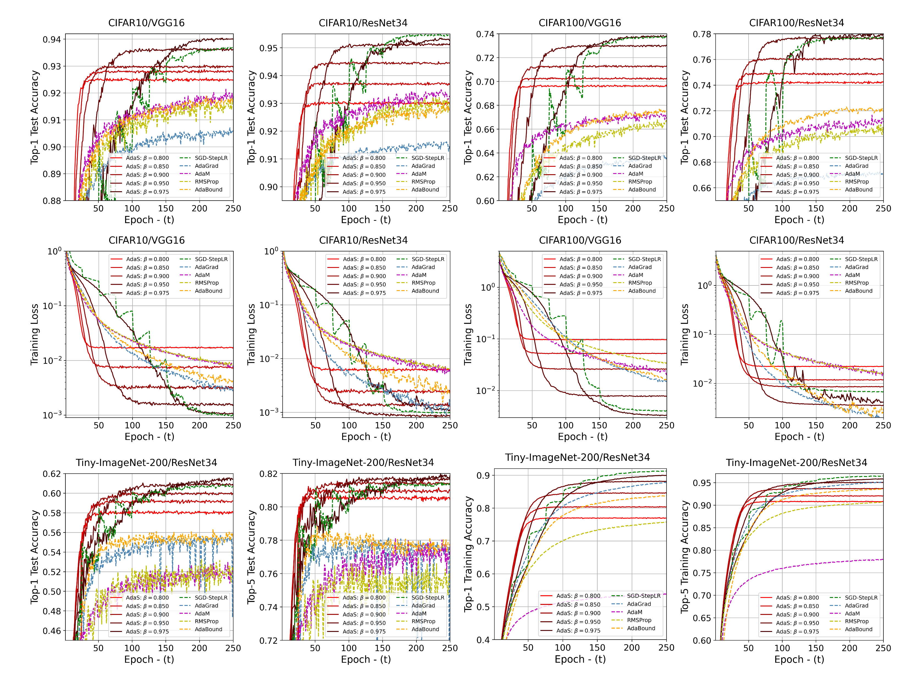
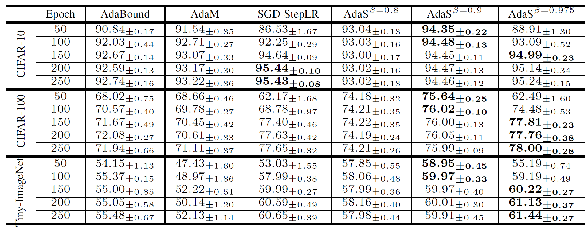

# [Adas: Adaptive Scheduling of Stochastic Gradients](https://openreview.net/forum?id=qUzxZj13RWY) #
## Status ##
[](LICENSE)
[](https://GitHub.com/Naereen/StrapDown.js/graphs/commit-activity)
[](https://www.python.org/downloads/release/python-370/)


## Table of Contents ##
- [Adas: Adaptive Scheduling of Stochastic Gradients](#adas--adaptive-scheduling-of-stochastic-gradients)
  * [Status](#status)
  * [Introduction](#introduction)
    + [License](#license)
    + [Citing Adas](#citing-adas)
    + [Empirical Classification Results on CIFAR10 and CIFAR100](#empirical-classification-results-on-cifar10-and-cifar100)
    + [QC Metrics](#qc-metrics)
  * [Requirements](#requirements)
    + [Software/Hardware](#software-hardware)
    + [Computational Overhead](#computational-overhead)
    + [Installation](#installation)
    + [Usage](#usage)
    + [Common Issues (running list)](#common-issues--running-list-)
  * [TODO](#todo)
    + [Pytest](#pytest)

## Introduction ##
**[Adas](https://openreview.net/forum?id=qUzxZj13RWY)** is an adaptive optimizer for scheduling the learning rate in training Convolutional Neural Networks (CNN)

- Adas exhibits the rapid minimization characteristics that adaptive optimizers like [AdaM](https://arxiv.org/abs/1412.6980) are favoured for
- Adas exhibits *generalization* (low testing loss) characteristics on par with SGD based optimizers, improving on the poor *generalization* characteristics of adaptive optimizers
- Adas introduces no computational overhead over adaptive optimizers (see [experimental results](#some-experimental-results))
- In addition to optimization, Adas introduces new probing metrics for CNN layer evaulation ([quality metrics](#knowledge-gain-vs-mapping-condition---cnn-quality-metrics))

This repository contains a [PyTorch](https://pytorch.org/) implementation of the Adas learning rate scheduler algorithm as well as the Knowledge Gain and Mapping Condition metrics.

Visit the `paper` branch to see the paper-related code. You can use that code to replicate experiments from the paper.

### License ###
Adas is released under the MIT License (refer to the [LICENSE](LICENSE) file for more information)
|Permissions|Conditions|Limitations|
|---|---|---|
| Commerical use| License and Copyright Notice| Liability|
| Distribution| |  Warranty|
| Modification | | |
| Private Use| | |

### Citing Adas ###
```text
@article{hosseini2020adas,
  title={Adas: Adaptive Scheduling of Stochastic Gradients},
  author={Hosseini, Mahdi S and Plataniotis, Konstantinos N},
  journal={arXiv preprint arXiv:2006.06587},
  year={2020}
}
```
### Empirical Classification Results on [CIFAR10](https://www.cs.toronto.edu/~kriz/cifar.html), [CIFAR100](https://www.cs.toronto.edu/~kriz/cifar.html) and [Tiny-ImageNet-200](http://cs231n.stanford.edu/tiny-imagenet-200.zip) ###

**Figure 1: Training performance using different optimizers across three datasets and two CNNs**



**Table 1: Image classification performance (test accuracy) with fixed budget epoch of ResNet34 training**


### QC Metrics ###
Please refer to [QC on Wiki](https://github.com/mahdihosseini/Adas/wiki/On-Quality-Metrics) for more information on two metrics of knowledge gain and mapping condition for monitoring training quality of CNNs

## Requirements ##
### Software/Hardware ###
We use `Python 3.7`.

Please refer to [Requirements on Wiki](https://github.com/mahdihosseini/Adas/wiki/On-Installation-Requirements) for complete guideline.

### Computational Overhead ###
Adas introduces no overhead (very minimal) over adaptive optimizers e.g. all mSGD+StepLR, mSGD+Adas, AdaM consume 40~43 sec/epoch to train ResNet34/CIFAR10 using the same PC/GPU platform

### Installation ###
1. You can install Adas directly from PyPi using `pip install adas', or clone this repository and install from source.
2. You can also download the files in `src/adas` into your local code base and use them directly. Note that you will probably need to modify the imports to be consistent with however you perform imports in your codebase.

All source code can be found in [src/adas](src/adas)

For more information, also refer to [Installation on Wiki](https://github.com/mahdihosseini/Adas/wiki/On-Package-Installation)


### Usage ###
The use Adas, simply import the `Adas(torch.optim.optimier.Optimizer)` class and use it as follows:
```Python
from adas import Adas

optimizer = Adas(params=list(model.parameters()),
                 lr: float = ???,
                 beta: float = 0.8
                 step_size: int = None,
                 gamma: float = 1,
                 momentum: float = 0,
                 dampening: float = 0,
                 weight_decay: float = 0,
                 nesterov: bool = False):
...
for epoch in epochs:
    for batch in train_dataset:
        ...
        loss.backward()
        optimizer.step()
    optimizer.epoch_step(epoch)
```
Note, `optipmizer.epoch_step()` is just to be called at the end of each epoch.
### Common Issues (running list) ###
- None :)

## TODO ###
- Add medical imaging datasets (e.g. digital pathology, xray, and ct scans)
- Extension of Adas to Deep Neural Networks

### Pytest ###
Note the following:
- Our Pytests write/download data/files etc. to `/tmp`, so if you don't have a `/tmp` folder (i.e. you're on Windows), then correct this if you wish to run the tests yourself
